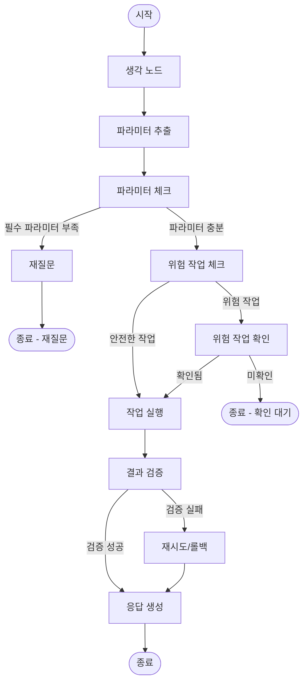

# BaseAgent with LangGraph 구현 가이드

## 목차
1. [개요](#개요)
2. [아키텍처](#아키텍처)
3. [BaseAgent 구조](#baseagent-구조)
4. [서브 에이전트 구현 방법](#서브-에이전트-구현-방법)
5. [워크플로우 상세 설명](#워크플로우-상세-설명)
6. [주요 기능](#주요-기능)
7. [사용 예시](#사용-예시)
8. [주의사항 및 베스트 프랙티스](#주의사항-및-베스트-프랙티스)

## 개요

이 가이드는 BaseAgent 클래스를 사용하여 LangGraph 기반의 서브 에이전트를 구현하는 방법을 설명합니다.

### 주요 특징
- **독립적인 LangGraph 워크플로우**: 각 서브 에이전트가 자신만의 워크플로우를 가짐
- **재질문 메커니즘**: 필수 파라미터가 부족할 때 사용자에게 질문
- **위험 작업 확인**: 삭제/종료 같은 위험한 작업 전 사용자 확인 요청
- **결과 검증**: 작업 실행 후 실제 리소스 상태 확인

## 아키텍처

### 전체 구조

```
Supervisor Agent
    ↓
[요청 분석] → [에이전트 라우팅]
    ↓
Sub Agent (EC2/S3/VPC)
    ↓
LangGraph Workflow
    ├─ think (생각)
    ├─ extract_parameters (파라미터 추출)
    ├─ check_parameters (파라미터 체크)
    ├─ reask (재질문) OR check_risk (위험 작업 확인)
    ├─ confirm_dangerous_action (위험 작업 확인) OR execute_action (작업 실행)
    ├─ verify_result (결과 검증)
    ├─ retry_or_rollback (재시도/롤백)
    └─ generate_response (응답 생성)
```

### 워크플로우 다이어그램



## BaseAgent 구조

### 클래스 계층 구조

```python
BaseAgent (추상 클래스)
├─ EC2Agent
├─ S3Agent
└─ VPCAgent
```

### BaseAgent 주요 메서드

#### 추상 메서드 (반드시 구현 필요)

```python
@abstractmethod
def get_agent_type(self) -> str:
    """에이전트 타입 반환 (예: 'ec2', 's3', 'vpc')"""
    pass

@abstractmethod
def get_required_parameters(self, action: str) -> List[str]:
    """액션별 필수 파라미터 목록 반환"""
    pass

@abstractmethod
def execute_action(self, action: str, parameters: Dict[str, Any]) -> Dict[str, Any]:
    """실제 작업 실행"""
    pass

@abstractmethod
def get_available_actions(self) -> List[str]:
    """지원하는 액션 목록 반환"""
    pass
```

#### 오버라이드 가능한 메서드

```python
def get_system_prompt(self) -> str:
    """시스템 프롬프트 (기본 제공, 오버라이드 가능)"""
    return f"당신은 AWS {self.get_agent_type().upper()} 리소스를 관리하는 전문 에이전트입니다..."

def get_dangerous_actions(self) -> List[str]:
    """위험 작업 목록 (기본: 빈 리스트, 오버라이드 가능)"""
    return []

def verify_action_result(self, action: str, parameters: Dict[str, Any], result: Dict[str, Any]) -> Dict[str, Any]:
    """결과 검증 (기본 검증 제공, 오버라이드 가능)"""
    return {"passed": result.get("success", False), "reason": "기본 검증"}
```

### 상태 구조 (SubAgentState)

```python
class SubAgentState(TypedDict):
    user_request: str                          # 사용자 요청
    context: Dict[str, Any]                    # 컨텍스트 정보
    thinking_result: Optional[Dict[str, Any]]  # 생각 노드 결과
    extracted_parameters: Optional[Dict[str, Any]]  # 추출된 파라미터
    missing_parameters: List[str]             # 부족한 필수 파라미터 목록
    reask_message: Optional[str]               # 재질문 메시지
    is_dangerous_action: bool                  # 위험 작업 여부
    dangerous_action_confirmed: bool           # 위험 작업 확인 여부
    confirmation_message: Optional[str]        # 확인 요청 메시지
    action_result: Optional[Dict[str, Any]]    # 실행 결과
    verification_result: Optional[Dict[str, Any]]  # 검증 결과
    verification_passed: bool                  # 검증 통과 여부
    final_response: Optional[str]             # 최종 응답
    needs_clarification: bool                 # 재질문 필요 여부
    action: Optional[str]                      # 액션명
    messages: List[BaseMessage]                # 메시지 히스토리
```

## 서브 에이전트 구현 방법

### 1. 기본 구조

```python
from .base_agent import BaseAgent
from typing import Dict, List, Any

class MyAgent(BaseAgent):
    """새로운 서브 에이전트"""
    
    def __init__(self, settings, aws_access_key: str = None, 
                 aws_secret_key: str = None, region: str = "us-east-1"):
        # BaseAgent 초기화 (필수)
        super().__init__(settings, aws_access_key, aws_secret_key, region)
        
        # 에이전트별 초기화 작업
        # 예: AWS 클라이언트, 도구 등
        self.my_tool = MyTool(aws_access_key, aws_secret_key, region)
```

### 2. 필수 메서드 구현

#### get_agent_type()

```python
def get_agent_type(self) -> str:
    """에이전트 타입 반환"""
    return "my_agent"  # 소문자로 반환
```

#### get_system_prompt()

```python
def get_system_prompt(self) -> str:
    """에이전트별 시스템 프롬프트"""
    return """당신은 AWS MyService 전문 에이전트입니다.
사용자의 요청을 분석하여 적절한 작업을 수행합니다.

지원하는 작업:
1. list_resources: 리소스 목록 조회
2. create_resource: 리소스 생성
3. delete_resource: 리소스 삭제

각 요청에 대해 다음 JSON 형식으로 응답해야 합니다:
{
    "action": "액션명",
    "parameters": {
        "파라미터명": "값"
    },
    "reasoning": "선택 이유"
}"""
```

#### get_required_parameters()

```python
def get_required_parameters(self, action: str) -> List[str]:
    """액션별 필수 파라미터 목록"""
    required_params = {
        "list_resources": [],                    # 파라미터 불필요
        "create_resource": ["ResourceName"],     # ResourceName 필수
        "delete_resource": ["ResourceId"],       # ResourceId 필수
    }
    return required_params.get(action, [])
```

#### get_dangerous_actions()

```python
def get_dangerous_actions(self) -> List[str]:
    """위험 작업 목록"""
    return ["delete_resource", "terminate_resource"]
```

#### get_available_actions()

```python
def get_available_actions(self) -> List[str]:
    """지원하는 액션 목록"""
    return [
        "list_resources",
        "create_resource",
        "delete_resource",
        "update_resource"
    ]
```

#### execute_action()

```python
def execute_action(self, action: str, parameters: Dict[str, Any]) -> Dict[str, Any]:
    """실제 작업 실행"""
    try:
        if action == "list_resources":
            # 리소스 목록 조회 로직
            result = self.my_tool.list_resources()
            return {"success": True, "resources": result}
        
        elif action == "create_resource":
            # 리소스 생성 로직
            resource_name = parameters.get("ResourceName")
            result = self.my_tool.create_resource(resource_name)
            return {"success": True, "resource_id": result}
        
        elif action == "delete_resource":
            # 리소스 삭제 로직
            resource_id = parameters.get("ResourceId")
            result = self.my_tool.delete_resource(resource_id)
            return {"success": True, "message": f"리소스 {resource_id} 삭제 완료"}
        
        else:
            return {"success": False, "error": f"지원하지 않는 액션: {action}"}
            
    except Exception as e:
        logger.error(f"작업 실행 중 오류: {e}")
        return {"success": False, "error": str(e)}
```

#### verify_action_result() (선택적 오버라이드)

```python
def verify_action_result(self, action: str, parameters: Dict[str, Any], 
                        result: Dict[str, Any]) -> Dict[str, Any]:
    """결과 검증 (기본 검증 오버라이드)"""
    if not result.get("success"):
        return {"passed": False, "reason": result.get("error", "작업 실행 실패")}
    
    # 액션별 상세 검증
    if action == "create_resource":
        resource_id = result.get("resource_id")
        if resource_id:
            # 실제로 리소스가 생성되었는지 확인
            try:
                actual_resource = self.my_tool.get_resource(resource_id)
                if actual_resource:
                    return {
                        "passed": True,
                        "reason": f"리소스 {resource_id}가 성공적으로 생성되었습니다."
                    }
            except Exception as e:
                logger.warning(f"리소스 검증 중 오류: {e}")
                return {"passed": True, "reason": "리소스 생성 API 호출 성공"}
    
    # 기본 검증
    return {"passed": True, "reason": "작업 실행 성공"}
```

### 3. 완전한 예시

```python
"""
MyService Agent 예시
"""
from .base_agent import BaseAgent
from typing import Dict, List, Any
import logging

logger = logging.getLogger(__name__)

class MyServiceAgent(BaseAgent):
    """MyService 리소스 관리 에이전트"""
    
    def __init__(self, settings, aws_access_key: str = None, 
                 aws_secret_key: str = None, region: str = "us-east-1"):
        super().__init__(settings, aws_access_key, aws_secret_key, region)
        
        # MyService 도구 초기화
        self.my_tool = MyServiceTool(aws_access_key, aws_secret_key, region)
    
    def get_agent_type(self) -> str:
        return "my_service"
    
    def get_system_prompt(self) -> str:
        return """당신은 AWS MyService 전문 에이전트입니다..."""
    
    def get_required_parameters(self, action: str) -> List[str]:
        return {
            "list_resources": [],
            "create_resource": ["ResourceName"],
            "delete_resource": ["ResourceId"]
        }.get(action, [])
    
    def get_dangerous_actions(self) -> List[str]:
        return ["delete_resource"]
    
    def get_available_actions(self) -> List[str]:
        return ["list_resources", "create_resource", "delete_resource"]
    
    def execute_action(self, action: str, parameters: Dict[str, Any]) -> Dict[str, Any]:
        # 구현 내용...
        pass
    
    def verify_action_result(self, action: str, parameters: Dict[str, Any], 
                            result: Dict[str, Any]) -> Dict[str, Any]:
        # 구현 내용...
        pass
```

## 워크플로우 상세 설명

### 1. Think Node (생각 노드)

**역할**: 사용자 요청을 분석하고 어떤 작업을 수행해야 할지 생각

**입력**: `user_request`

**출력**: `thinking_result` (생각 내용)

**프롬프트**: 시스템 프롬프트 + "사용자의 요청을 분석하고 어떤 작업을 수행해야 할지 생각해보세요."

### 2. Extract Parameters Node (파라미터 추출 노드)

**역할**: 사용자 요청에서 액션과 필요한 파라미터를 추출

**입력**: `user_request`, `thinking_result`

**출력**: `action`, `extracted_parameters`

**프롬프트**: 시스템 프롬프트 + 지원하는 액션 목록 + JSON 형식 요구사항

### 3. Check Parameters Node (파라미터 체크 노드)

**역할**: 필수 파라미터가 모두 있는지 확인

**입력**: `action`, `extracted_parameters`

**출력**: `needs_clarification`, `missing_parameters`

**로직**:
- `get_required_parameters(action)` 호출하여 필수 파라미터 목록 가져오기
- 추출된 파라미터와 비교하여 부족한 파라미터 찾기
- 부족한 파라미터가 있으면 `needs_clarification=True` 설정

### 4. Reask Node (재질문 노드)

**역할**: 부족한 파라미터에 대해 사용자에게 질문 생성

**입력**: `missing_parameters`, `action`

**출력**: `reask_message`

**프롬프트**: "부족한 정보를 사용자에게 친절하게 질문하세요."

**주의**: 재질문이 생성되면 워크플로우가 종료되고 Supervisor Agent를 통해 사용자에게 전달됨

### 5. Check Risk Node (위험 작업 체크 노드)

**역할**: 액션이 위험 작업인지 확인하고 확인 메시지 생성

**입력**: `action`, `extracted_parameters`

**출력**: `is_dangerous_action`, `confirmation_message`

**로직**:
- `get_dangerous_actions()` 호출하여 위험 작업 목록 가져오기
- 현재 액션이 위험 작업 목록에 있는지 확인
- 위험 작업이면 LLM을 사용하여 확인 메시지 생성

### 6. Confirm Dangerous Action Node (위험 작업 확인 노드)

**역할**: 사용자 확인 상태 확인

**입력**: `dangerous_action_confirmed`

**출력**: 상태 유지

**주의**: 실제 확인은 Supervisor Agent를 통해 처리되며, 여기서는 상태만 확인

### 7. Execute Action Node (작업 실행 노드)

**역할**: 실제 작업 실행

**입력**: `action`, `extracted_parameters`

**출력**: `action_result`

**로직**: `execute_action(action, parameters)` 호출

### 8. Verify Result Node (결과 검증 노드)

**역할**: 작업 실행 결과 검증

**입력**: `action`, `parameters`, `action_result`

**출력**: `verification_result`, `verification_passed`

**로직**: `verify_action_result(action, parameters, result)` 호출

### 9. Retry or Rollback Node (재시도/롤백 노드)

**역할**: 검증 실패 시 재시도 또는 롤백 처리

**입력**: `verification_result`, `action_result`

**출력**: `final_response` (오류 메시지)

**현재 구현**: 간단하게 오류 메시지만 설정 (향후 재시도 로직 추가 가능)

### 10. Generate Response Node (응답 생성 노드)

**역할**: 최종 사용자 응답 생성

**입력**: `action_result`, `verification_passed`

**출력**: `final_response`

**프롬프트**: 시스템 프롬프트 + "작업이 성공적으로 완료되었습니다. 사용자에게 친절하게 결과를 알려주세요."

## 주요 기능

### 1. 재질문 메커니즘

**동작 방식**:
1. 파라미터 추출 후 필수 파라미터 체크
2. 부족한 파라미터가 있으면 `needs_clarification=True` 설정
3. 재질문 노드에서 LLM을 사용하여 사용자 친화적인 질문 생성
4. Supervisor Agent를 통해 사용자에게 전달
5. 사용자 응답을 받아서 `user_request`에 추가하여 다시 워크플로우 시작

**예시**:
```
사용자: "EC2 인스턴스를 만들어줘"
  ↓
EC2 Agent: "어떤 인스턴스 타입을 원하시나요? (t2.micro, t3.small 등)"
  ↓
사용자: "t2.micro로 해줘"
  ↓
EC2 Agent: 인스턴스 생성 진행
```

### 2. 위험 작업 확인 메커니즘

**동작 방식**:
1. 파라미터 추출 후 액션이 위험 작업 목록에 있는지 확인
2. 위험 작업이면 `is_dangerous_action=True` 설정
3. 확인 노드에서 LLM을 사용하여 위험성과 영향 범위를 설명하는 확인 메시지 생성
4. Supervisor Agent를 통해 사용자에게 확인 요청
5. 사용자가 확인하면 `dangerous_action_confirmed=True` 설정 후 실행
6. 사용자가 거부하면 워크플로우 종료

**예시**:
```
사용자: "EC2 인스턴스를 삭제해줘"
  ↓
EC2 Agent: "⚠️ 경고: 이 작업은 EC2 인스턴스 i-1234567890abcdef0를 영구적으로 삭제합니다. 
            이 작업은 되돌릴 수 없으며, 인스턴스의 모든 데이터가 손실됩니다. 
            정말로 계속하시겠습니까? (yes/no)"
  ↓
사용자: "yes"
  ↓
EC2 Agent: 인스턴스 삭제 진행
```

### 3. 결과 검증 메커니즘

**동작 방식**:
1. 작업 실행 후 `verify_result_node` 실행
2. 각 에이전트의 `verify_action_result()` 메서드 호출
3. AWS API 응답 검증 및 실제 리소스 상태 확인
4. 검증 실패 시:
   - 일시적 오류면 재시도 (향후 구현)
   - 영구적 오류면 롤백 시도 (향후 구현)
   - 사용자에게 오류 보고

**예시**:
```python
def verify_action_result(self, action: str, parameters: Dict[str, Any], 
                        result: Dict[str, Any]) -> Dict[str, Any]:
    if action == "create_instance":
        instance_id = result.get("instance_id")
        # 실제로 인스턴스가 생성되었는지 확인
        response = ec2_client.describe_instances(InstanceIds=[instance_id])
        if response['Reservations']:
            return {"passed": True, "reason": f"인스턴스 {instance_id} 생성 확인"}
```

## 사용 예시

### 기본 사용법

```python
from src.agents.ec2_agent import EC2Agent
from src.config.settings import get_settings

# 설정 로드
settings = get_settings()

# EC2 Agent 생성
ec2_agent = EC2Agent(
    settings=settings.multi_agent,
    aws_access_key="your-access-key",
    aws_secret_key="your-secret-key",
    region="ap-northeast-2"
)

# 요청 처리
result = await ec2_agent.process_request(
    user_request="EC2 인스턴스를 만들어줘",
    context={}
)

# 결과 확인
if result.get("needs_clarification"):
    print(f"재질문: {result['reask_message']}")
elif result.get("needs_confirmation"):
    print(f"확인 요청: {result['confirmation_message']}")
elif result.get("success"):
    print(f"성공: {result['response']}")
else:
    print(f"오류: {result.get('error')}")
```

### 재질문 처리 예시

```python
# 첫 번째 요청
result1 = await ec2_agent.process_request("EC2 인스턴스를 만들어줘")

if result1.get("needs_clarification"):
    # 사용자에게 재질문 전달
    user_response = input(result1['reask_message'])
    
    # 사용자 응답을 포함하여 다시 요청
    updated_request = f"EC2 인스턴스를 만들어줘. {user_response}"
    result2 = await ec2_agent.process_request(updated_request)
```

### 위험 작업 확인 처리 예시

```python
# 위험 작업 요청
result = await ec2_agent.process_request("EC2 인스턴스 i-123을 삭제해줘")

if result.get("needs_confirmation"):
    # 사용자에게 확인 요청
    user_confirmation = input(result['confirmation_message'])
    
    if user_confirmation.lower() == "yes":
        # 확인된 경우, 상태를 업데이트하여 다시 실행
        # (실제 구현에서는 Supervisor Agent가 처리)
        pass
```

## 주의사항 및 베스트 프랙티스

### 1. 필수 파라미터 정의

- **명확하게 정의**: 각 액션의 필수 파라미터를 명확히 정의하세요
- **기본값 고려**: 일부 파라미터는 기본값을 사용할 수 있도록 선택적으로 만들 수 있습니다
- **예시**:
  ```python
  def get_required_parameters(self, action: str) -> List[str]:
      if action == "create_instance":
          # instance_type과 ami_id는 기본값 사용 가능하므로 필수 아님
          return []  # 또는 선택적 파라미터만 반환
      elif action == "terminate_instance":
          return ["InstanceIds"]  # 인스턴스 ID는 필수
  ```

### 2. 위험 작업 목록 관리

- **보수적으로 정의**: 의심스러우면 위험 작업으로 분류하세요
- **명확한 설명**: 확인 메시지에서 위험성과 영향 범위를 명확히 설명하세요
- **예시**:
  ```python
  def get_dangerous_actions(self) -> List[str]:
      return [
          "delete_resource",      # 삭제 작업
          "terminate_resource",    # 종료 작업
          "modify_critical_config" # 중요한 설정 변경
      ]
  ```

### 3. 결과 검증 구현

- **실제 리소스 확인**: API 응답만 확인하지 말고 실제 리소스 상태를 확인하세요
- **오류 처리**: 검증 중 오류가 발생해도 기본 검증은 통과하도록 처리하세요
- **예시**:
  ```python
  def verify_action_result(self, action: str, parameters: Dict[str, Any], 
                          result: Dict[str, Any]) -> Dict[str, Any]:
      try:
          # 실제 리소스 확인
          if action == "create_resource":
              resource_id = result.get("resource_id")
              actual_resource = self.tool.get_resource(resource_id)
              if actual_resource:
                  return {"passed": True, "reason": "리소스 생성 확인"}
      except Exception as e:
          logger.warning(f"검증 중 오류: {e}")
          # 기본 검증으로 폴백
          return {"passed": result.get("success", False), "reason": "기본 검증"}
  ```

### 4. 시스템 프롬프트 작성

- **명확한 지시사항**: 에이전트가 수행해야 할 작업을 명확히 설명하세요
- **응답 형식 지정**: JSON 형식 등 응답 형식을 명확히 지정하세요
- **예시 포함**: 가능하면 예시를 포함하세요

### 5. 에러 처리

- **예외 처리**: 모든 메서드에서 예외를 적절히 처리하세요
- **로깅**: 중요한 단계에서 로깅을 수행하세요
- **사용자 친화적 메시지**: 오류 메시지를 사용자가 이해하기 쉽게 작성하세요

### 6. 테스트

- **단위 테스트**: 각 메서드를 개별적으로 테스트하세요
- **통합 테스트**: 전체 워크플로우를 테스트하세요
- **엣지 케이스**: 재질문, 위험 작업 확인 등 엣지 케이스를 테스트하세요

## 참고 자료

- [LangGraph 공식 문서](https://langchain-ai.github.io/langgraph/)
- [BaseAgent 소스 코드](../src/agents/base_agent.py)
- [EC2Agent 구현 예시](../src/agents/ec2_agent.py)
- [S3Agent 구현 예시](../src/agents/s3_agent.py)
- [VPCAgent 구현 예시](../src/agents/vpc_agent.py)

## FAQ

### Q: 새로운 에이전트를 추가하려면 어떻게 해야 하나요?

A: 
1. `BaseAgent`를 상속하는 새 클래스 생성
2. 필수 메서드 구현 (`get_agent_type`, `get_required_parameters`, `execute_action`, `get_available_actions`)
3. `AgentFactory`에 등록

### Q: 워크플로우를 커스터마이징할 수 있나요?

A: 현재는 BaseAgent의 워크플로우를 그대로 사용합니다. 커스터마이징이 필요하면 BaseAgent를 상속받아 `_build_graph()` 메서드를 오버라이드할 수 있습니다.

### Q: 재질문이 여러 번 발생할 수 있나요?

A: 네, 가능합니다. 사용자가 응답한 후에도 필수 파라미터가 부족하면 다시 재질문이 발생합니다.

### Q: 위험 작업 확인을 건너뛸 수 있나요?

A: 현재는 불가능합니다. 위험 작업은 반드시 사용자 확인을 받아야 합니다. 자동화가 필요하면 `get_dangerous_actions()`에서 해당 액션을 제거하거나 별도의 설정을 추가할 수 있습니다.

### Q: 결과 검증이 실패하면 어떻게 되나요?

A: 현재는 오류 메시지를 사용자에게 전달합니다. 향후 재시도 또는 롤백 로직이 추가될 예정입니다.


